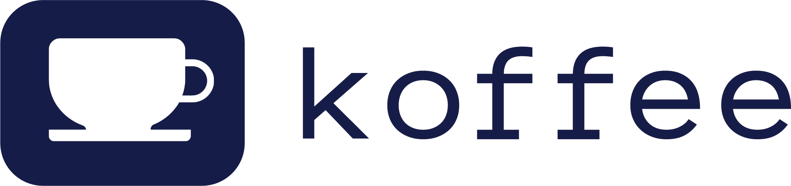

# koffee

---

**Documentation:** [https://koffee.readthedocs.io/](https://americanbeautyinstitute.readthedocs.io/)

**Source Code:** [https://github.com/andrewwkimm/koffee](https://github.com/andrewwkimm/koffee)

---
